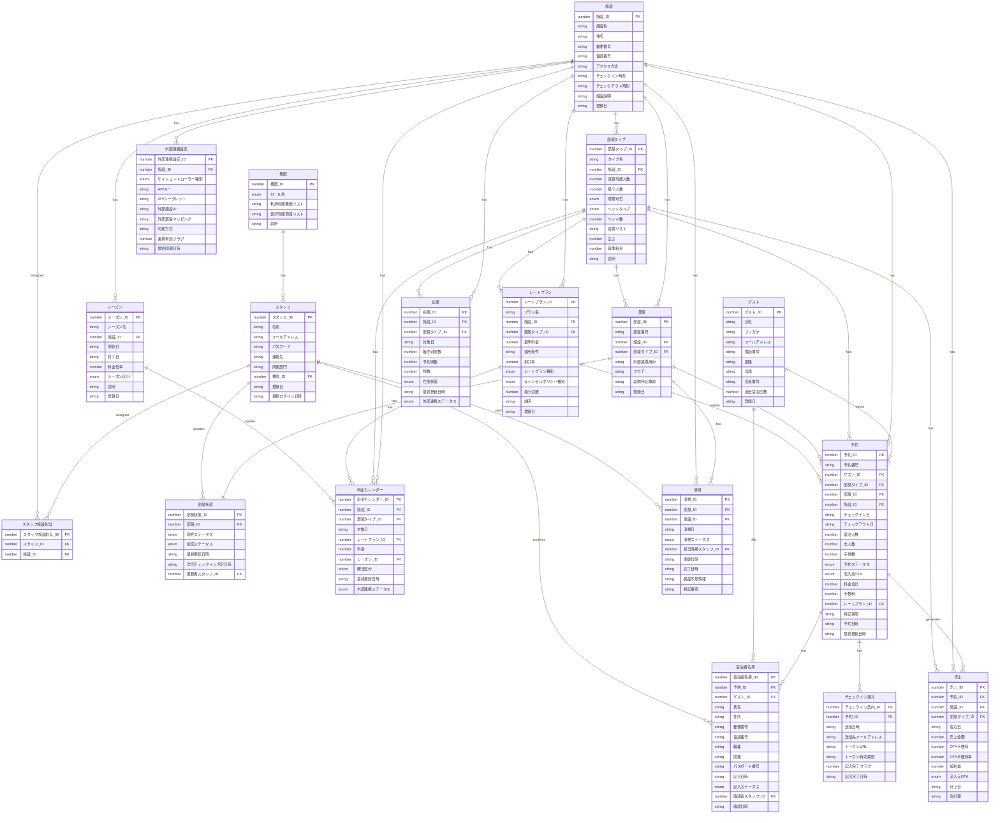

# 論理データモデル

## 概要
宿泊施設管理システム（PMS）の論理データモデルを示します。
本モデルは、スタッフ・権限管理、施設・部屋管理、料金管理、予約管理、宿泊者名簿管理、清掃管理、売上分析、外部連携の各コンテキストを網羅しています。

## ER図

## コンテキスト別データ構成

### 1. スタッフ・権限管理コンテキスト
- **スタッフ**: システムを利用するスタッフ情報
- **権限**: スタッフに付与する権限ロール
- **スタッフ施設割当**: スタッフと施設の多対多関係を管理

### 2. 施設・部屋管理コンテキスト
- **施設**: 宿泊施設の基本情報
- **部屋タイプ**: 部屋の種類（シングル、ツインなど）
- **部屋**: 実際の部屋情報
- **部屋状態**: 部屋の現在の状態（Vacant、Occupied等）

### 3. 料金管理コンテキスト
- **シーズン**: 繁忙期・閑散期などのシーズン設定
- **レートプラン**: 料金プラン設定
- **料金カレンダー**: 日別の料金設定

### 4. 予約管理コンテキスト
- **ゲスト**: 宿泊者の基本情報
- **予約**: 予約情報
- **在庫**: 部屋タイプ別・日別の在庫管理

### 5. 宿泊者名簿管理コンテキスト
- **宿泊者名簿**: 旅館業法に基づく宿泊者名簿
- **チェックイン案内**: ゲストへの案内メール管理

### 6. 清掃管理コンテキスト
- **清掃**: 部屋ごとの清掃作業管理

### 7. 売上分析コンテキスト
- **売上**: 売上データ（ADR、OCC、RevPAR計算の基礎データ）

### 8. 外部連携コンテキスト
- **外部連携設定**: サイトコントローラー連携設定

## 状態モデル

### 予約状態
- 予約確定 → チェックイン済 → チェックアウト済
- 予約確定 → キャンセル
- 予約確定 → ノーショー

### 部屋状態
- Vacant → Occupied → Dirty → Cleaning → Inspected → Vacant
- Vacant ↔ Out-of-order

### 清掃状態
- 未着手 → 清掃中 → 清掃完了 → 点検済

### 宿泊者名簿記入状態
- 未送信 → 送信済 → 記入済 → 確認済

### 在庫状態
- 販売可能 ↔ 満室
- 販売可能 ↔ 調整中
